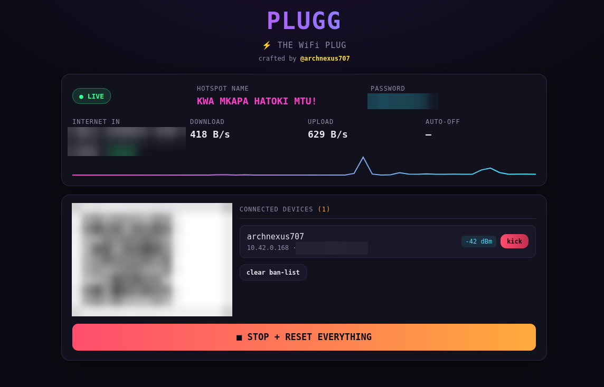
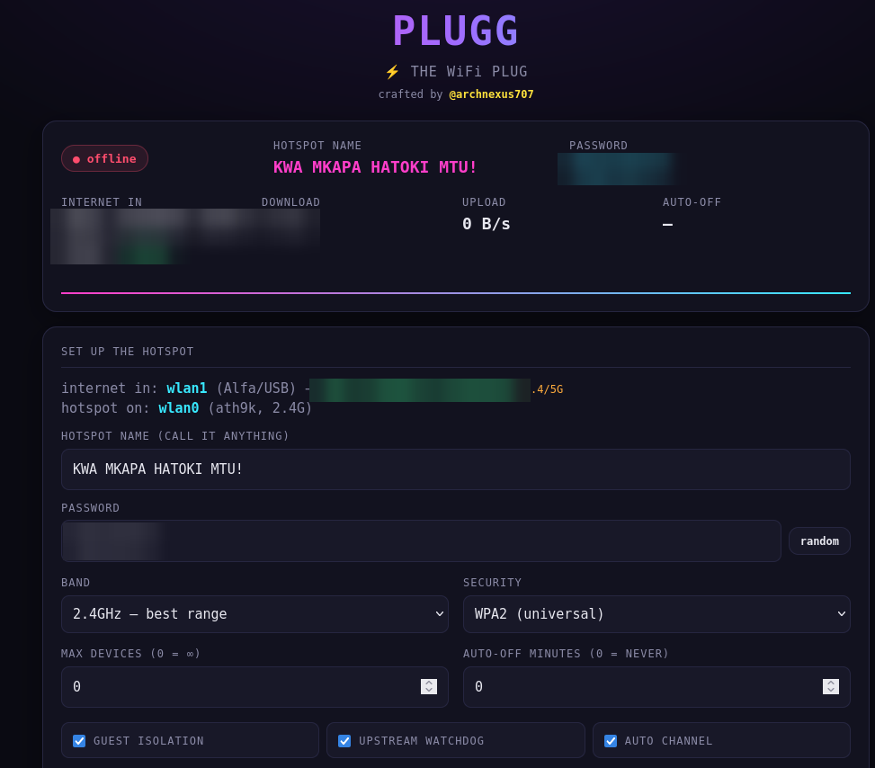
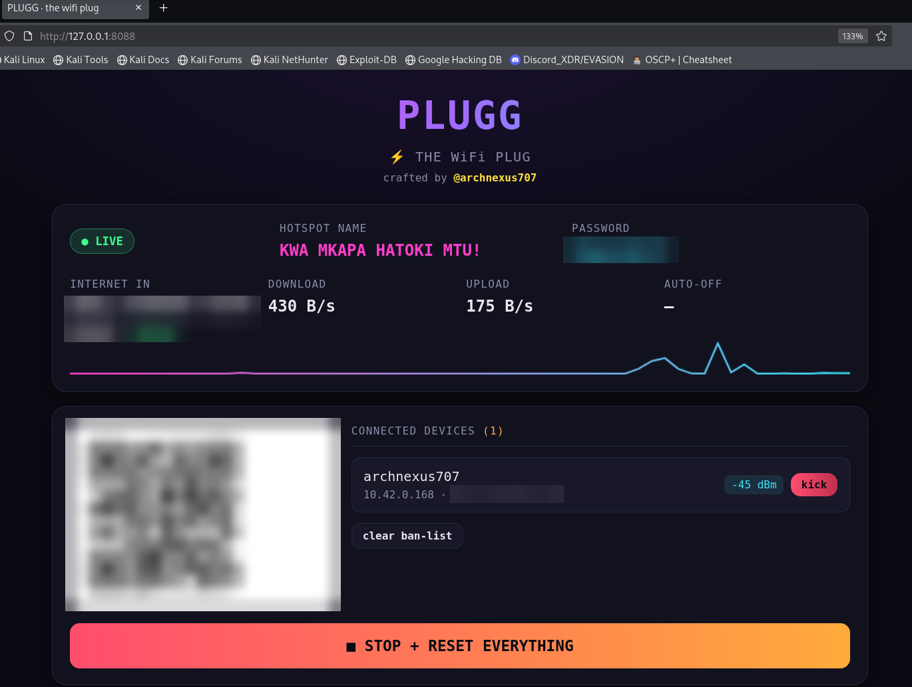
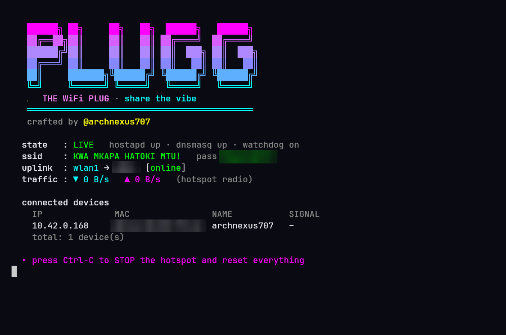

# PLUGG 🔌
### ⚡ THE WiFi PLUG · by @archnexus707

**PLUGG turns your Linux machine into a secured WiFi hotspot.** It takes the internet
coming in on one adapter (say a long range Alfa connected to a distant network) and
shares it back out through a second radio as a locked down WPA2 or WPA3 access point,
with full NAT, DHCP, DNS, guest isolation and a live web dashboard you can drive from
your phone.

It was built for a real situation : one laptop, two wireless cards, a weak upstream
signal, and a room full of people who all needed internet. PLUGG detects your setup on
its own, asks a few questions, and goes live. When the upstream flaps, it fails over to
a backup uplink and keeps everyone online. When you close it, it puts your machine back
exactly the way it was.

<p align="center">
  
</p>

---

## Why it exists

Sharing a connection on Linux is famously fiddly : hostapd configs, dnsmasq, NAT rules,
policy routing, NetworkManager fighting you for the interface. PLUGG does all of it for
you, correctly, and cleans up after itself. No half configured interfaces left behind,
no manual teardown.

## Features

- **⚡ Auto mode** : detects which adapter has the internet and which one can be the
  access point, then configures and launches everything in one flow.
- **🌐 Web dashboard** : a full control panel in the browser, open it on the laptop or
  from your phone once it is connected to the hotspot.
- **📱 QR code join** : scan to connect, no typing the password on every device.
- **🛡 Guest isolation** : clients reach the internet but not each other or your local LAN.
- **💚 Self healing failover** : if the preferred upstream loses internet, traffic fails
  over to another uplink automatically and recovers when it comes back.
- **📊 Live bandwidth** : real time download and upload with a moving sparkline.
- **🚫 Kick and ban** : boot a device from the dashboard and block its MAC, live.
- **💾 Named profiles** : save a whole setup and reload it later, save straight from the
  web UI or the terminal.
- **📡 Auto channel** : scans the air and picks the least congested channel.
- **⏱ Auto off timer** : share for a set number of minutes, then shut down and reset on
  its own.
- **🧢 Max devices cap** : limit how many devices can join so the link stays fast.
- **🔀 Dual band aware** : detects 2.4GHz and 5GHz capability per adapter and only offers
  5GHz when the access point radio supports it.
- **🎨 Custom hotspot name** : call your network anything you like.

## The dashboard

<p align="center">
  
</p>

Set it up, hit start, and the panel switches to a live view with connected devices,
signal strength, a kick button per device, the join QR, and a bandwidth graph.

<p align="center">
  
</p>

## Install

```bash
git clone https://github.com/archnexus707/PLUGG.git
cd PLUGG
./setup.sh          # installs everything : hostapd, dnsmasq, iw, nftables, qrencode, flask
```

## Use it

**Terminal**

```bash
sudo ./launcher.sh          # interactive menu
sudo ./launcher.sh auto     # detect, ask, run, then live dashboard
```

<p align="center">
  
</p>

**Browser** (recommended, control it from your phone)

```bash
sudo ./webui.sh             # prints the URLs and opens your browser
```

It prints where to reach it :

```
▸ on THIS laptop : http://127.0.0.1:8088
▸ from a phone   : http://10.42.0.1:8088
▸ from the LAN   : http://192.168.1.101:8088
```

Open it, pick a name, set a password, hit start. Connect your phone to the hotspot and
open the `10.42.0.1` address to run the whole thing from your hand.

## How it fits together

```
   [ upstream WiFi / wired ]                     nearby phones and laptops
            │  (internet in)                              │  (WiFi out)
      wlan1  (Alfa, USB, long range)              wlan0  (internal AP radio)
      client                                      access point
            │                                            │
            └──────────────  this machine (NAT)  ────────┘
                    policy routed, with automatic failover
```

Three files, three roles :

- **launcher.sh** : the engine and the terminal menu, it does the real network work.
- **plugg_web.py** : the web server and dashboard page, it calls the engine for you.
- **webui.sh** : starts the web server, opens your browser, cleans up on exit.

You only ever launch **launcher.sh** for the terminal or **webui.sh** for the browser.

## It always cleans up

On exit, Ctrl C, terminal close, or the auto off timer, PLUGG restores the routing
table, the firewall rules, IP forwarding, and hands the access point radio back to
NetworkManager. Nothing permanent is changed on your system.

## A note on responsible use

PLUGG re-shares an internet connection you are authorised to use. Make sure whoever runs
the source network is fine with you sharing it onward. That is a policy call, not a
technical one.

---

<p align="center"><b>PLUGG</b> · built on Kali · by @archnexus707</p>
